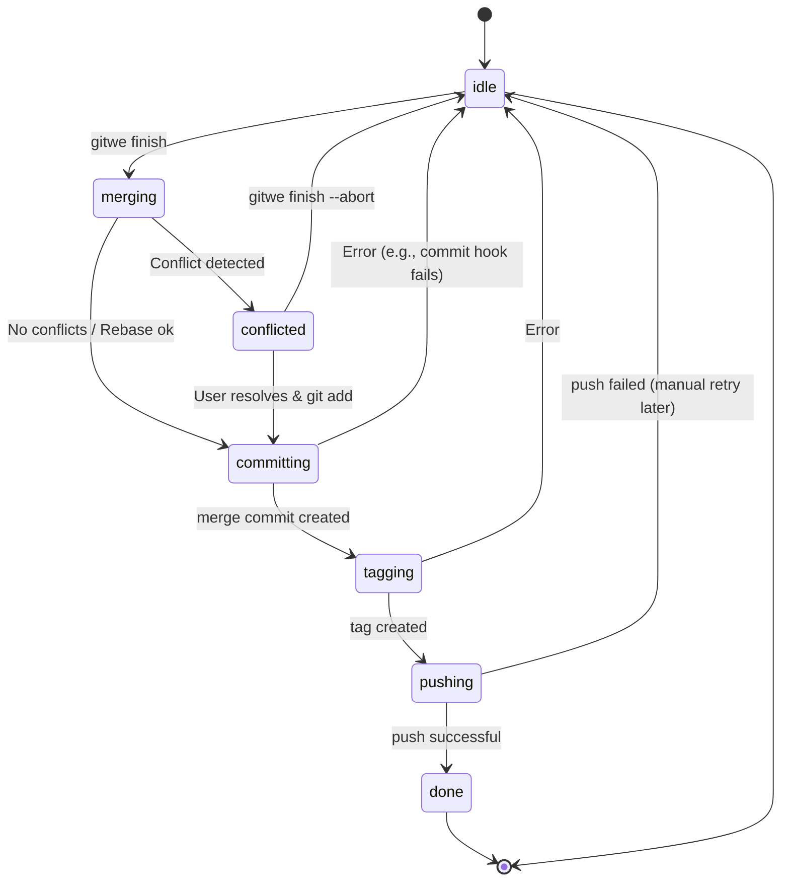

# Finish State Machine

The `gitwe finish` operation is **resumable**. If a merge or rebase fails (e.g., due to conflicts), gitwe persists its state to `.gitwe/state.json`. This allows you to continue (`--continue`) or abort (`--abort`) the operation later.

## States

| State | Description |
| :--- | :--- |
| `idle` | No finish operation in progress. |
| `merging` | The topic branch is being merged into the target base (or the target is being merged into the topic for rebase strategies). |
| `conflicted` | A conflict occurred. The user must resolve it manually. |
| `committing` | Conflicts resolved, changes staged, ready to commit the merge result. |
| `tagging` | (if configured) Creating the version tag. |
| `pushing` | Pushing branches/tags to the remote (if `--push` is used). |
| `done` | Operation completed successfully. The state file is removed. |

## State Diagram (Mermaid)

You can render this diagram in any Mermaid-compatible viewer (GitHub, VS Code, etc.).



## How to Resume

When in the `conflicted` state:

1. Fix the conflicts in your working directory.
2. Stage the changes:
   ```bash
   git add .
   ```
3. Resume:
   ```bash
   gitwe finish --continue
   ```

If you want to start over:

```bash
gitwe finish --abort
```

## State File Location

The internal state is stored in `.gitwe/state.json`. It is **not** committed to the repository.
You can examine it manually for debugging, but it is recommended to use the CLI (`gitwe overview`) to interpret it safely.
